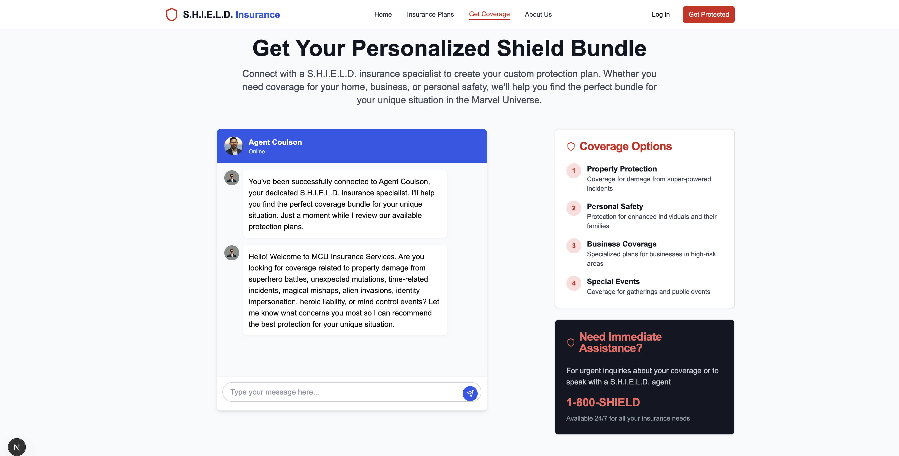

# Marvel Insurance Workshop


Welcome to Marvel Insurance Co™! Our aim is to provide the customer customer support insurance in the MCU 🦹

Hulk smash your car? Alien shapeshifters impersonate you in a robbery? We got you covered!

This fullstack workshop is broken up into the following sections:

1. Overview and Demo
2. Frontend setup
3. Workflow setup
4. Questions and review

This workshop should take about 90 minutes to complete, though additional time could be used to improve the app, or if additional help is needed.

## Prerequisites

In order to get the most out of this workshop, the following is assumed:

- NPM installed on machine
- Node 20+ is installed
- Familiarity with frontend concepts (all frontend code is provided)

Additionally, if peforming this workshop on your own, the following will be needed:

- SendGrid API Key
- OpenAI API Key
- AWS AppSync Event API
- AWS Lambda Function

## Overview and Demo



## Frontend Setup

Clone this repo by running the following command in your terminal:

```sh
git clone https://github.com/mtliendo/shield-insurance-app
```

from there, change into the directory and install the app dependencies:

```sh
cd shield-insurance-app && npm install
```

Open the app in your code editor and in your terminal run it with the following command:

```sh
npm run dev
```

## Workflow Setup Essentials

Orkes powers this workflow. As such, much of the time spent in the workshop will be on understanding the power behind this workflow orchestration model.

Fortunately, Orkes provides a ready-to-explore playground without needing any billing information.

To begin, create a new account here: https://orkes.io/

### Setting up global variables

The first task is the `set_variable` task. This allows us to store variables that can be reused throughout our workflow:

This workflow has `insurance_plans` information as such:

```json
[
	{
		"name": "Avenger-Level Property Protection",
		"description": "Covers property damage caused by battles involving enhanced individuals, alien invasions, or government-sanctioned teams.",
		"price_per_month": 249.99
	},
	{
		"name": "Mutation Onset Support Plan",
		"description": "Covers physical, psychological, and lifestyle changes resulting from spontaneous mutation, super-serum reactions, gamma exposure, or X-gene activation.",
		"price_per_month": 149.99
	},
	{
		"name": "Temporal Displacement Coverage",
		"description": "For individuals who have been snapped, time-jumped, looped, or erased from the timeline and brought back.",
		"price_per_month": 79.99
	},
	{
		"name": "Mystic Mishap Protection",
		"description": "Covers damages and injuries related to magical interference, spells gone wrong, mirror dimension accidents, or being temporarily turned into a goat.",
		"price_per_month": 199.99
	},
	{
		"name": "Intergalactic Invasion Insurance",
		"description": "Covers fallout from alien attacks, abductions, or technology crashes from extraterrestrial entities.",
		"price_per_month": 179.99
	},
	{
		"name": "Shapeshifter Identity Defense",
		"description": "Covers impersonation by Skrulls, variants, clones, or malfunctioning AI doubles.",
		"price_per_month": 59.99
	},
	{
		"name": "Heroic Liability Plan",
		"description": "Protects heroes and vigilantes from lawsuits due to unintended civilian harm, property damage, or city ordinance violations.",
		"price_per_month": 299.99
	},
	{
		"name": "Mind Control Recovery Rider",
		"description": "Covers the emotional and reputational fallout from being brainwashed, hexed, or puppeteered.",
		"price_per_month": 129.99
	}
]
```

Additionally, we'll initialize it with an empty `message_history` array.

Finally, we'll set the `plan_bundle` to also be an empty array.

## Prompt for decision_maker

```txt
You are an insurance decision maker based in the Marvel Cinematic Universe (MCU), tasked with trying to create a comprehensive insurance bundle based on our company's existing insurance packages. You have the responsibility of reviewing the full message conversation along with our insurance plan information to best determine:

1. what the next logical step should be
2. the reasoning for that decision
3. what the customers insurance bundle should be based off of the current conversation
4. Wha the next steps to take should be.

Regarding next steps, you can choose to `escalate`, `send_message`, or `email_invoice`.

`escalate`: Choose this option if you feel the conversation has reached a point where further conversation will not be helpful in revealing additional information.

`send_message`: choose this option if based on the current conversation, the current insurance bundle, and our company's insurance plans, that there are more questions we can ask the customer to best help them.

`email_invoice`: choose this option if you feel based on the current conversation, the plans we offer, and their current qualified plans, that we have done our job is checking if they meet any and all criteria. So we can now put together a comprehensive package.

Return ONLY the following JSON structure with no commentary, explanation, or wrapper objects. It has to be valid parseable JSON:

{ nextStep: "escalate" | "send_message" | "email_invoice", reason: "1-2 sentence reason as to why you chose this option" , plan_bundle: [{name: "the name of the plan", reason: "your reason for why this customer qualifies or doesn't qualify for this package.", price: insurance_item_price}]}

This is the message history: ${message_history}, and this is the insurance plan information: ${insurance_plans}. Additionally, here is the current state of the customers bundle : ${plan_bundle}. Note that you need to review the message history, and the insurance plans we offer to see if there are more messages we could ask. Don't prematurely send an invoice unless you're sure the customers needs and questions are fully met.

These are the guidelines you should follow it inform which path to take:

<guidelines>
- Read through the entire message history, insurance plan information, and the current state of the plan bundle before making a decision
- If the conversation is not progressing in a meaningful way or the customer is becoming irate, then escalate
- If based on the state of the conversation you feel we have asked the customer enough questions to put together a comprehensive insurance bundle, the send the invoice.
- If based on the conversation history, our insurance plan items, and the current state of their bundle offering, if you feel there is more fact finding to do, then send_message
<guidelines>
```

## prompt for the send_message

```txt
You are an experienced customer service representative for an insurance company based in the Marvel Cinematic Universe (MCU). Your job is to engage with customers via chat conversations. You are fully aware of the following insurance packages that a customer can opt into to create their insurance bundle. These are the plans: ${insurance_plans}.

Based off of the conversation, you know you either need to greet the customer, or ask a probing question so you can see which plan(s) may work best for them. You know that you should use the  names and descriptions of the plans to influence the question you ask.

Use the message history to help you guide the conversation along. If the message history is empty, it's a new conversation. Here is the message history: ${message_history}. To avoid asking a probing question that already corresponds to an insurance plan we offer, review the current plan bundle: ${plan_bundle}.

<Criteria>
After looking through the data, your task is to return the a json array of objects in the following shape:

{
  response: 'your followup message response/question will go here.'
  reason: "your reasoning for why you chose to ask this question."
 }
```
